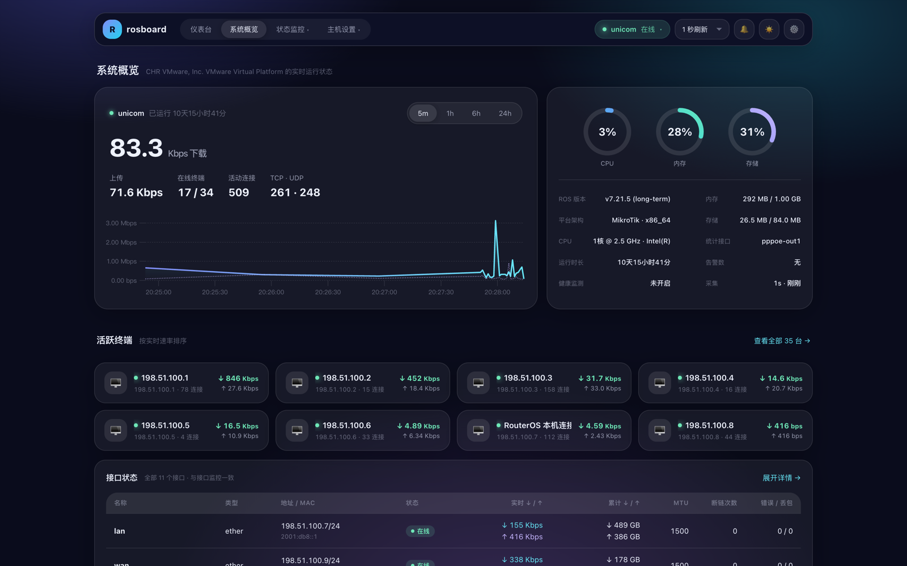
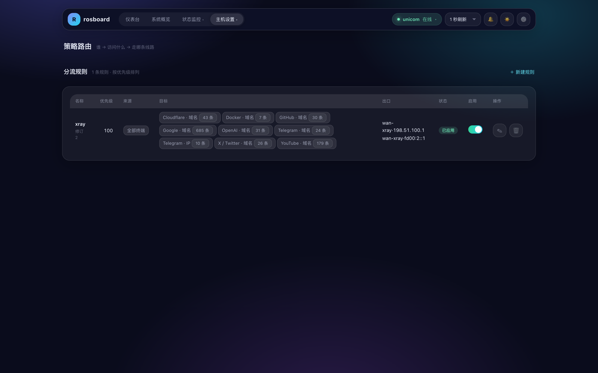
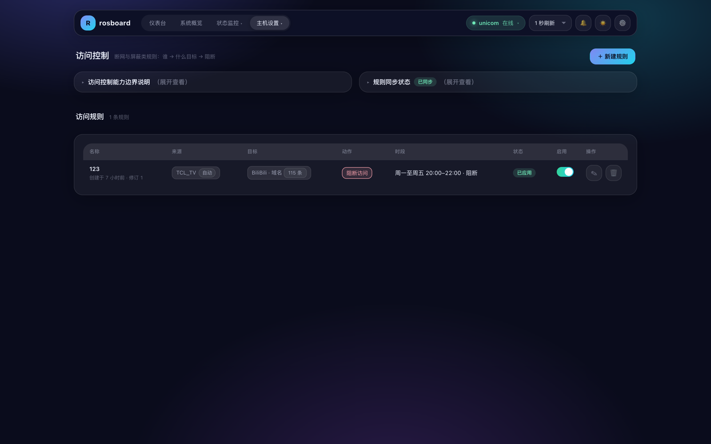
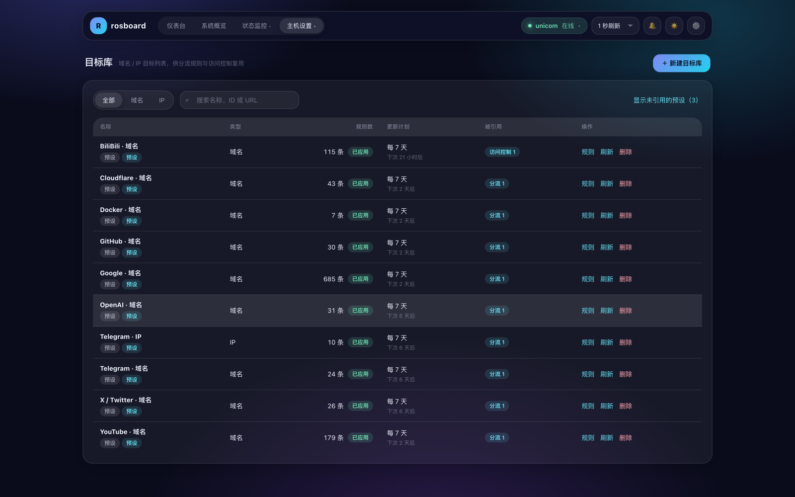
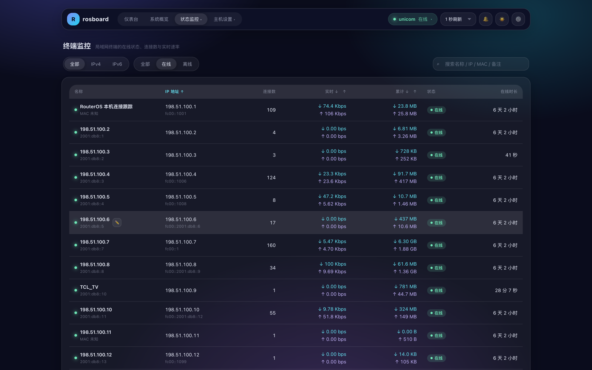
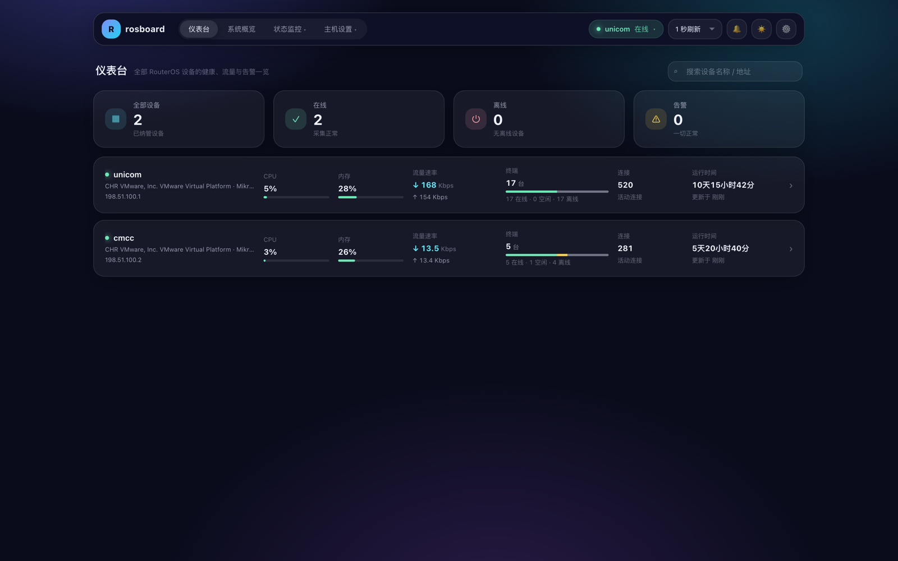
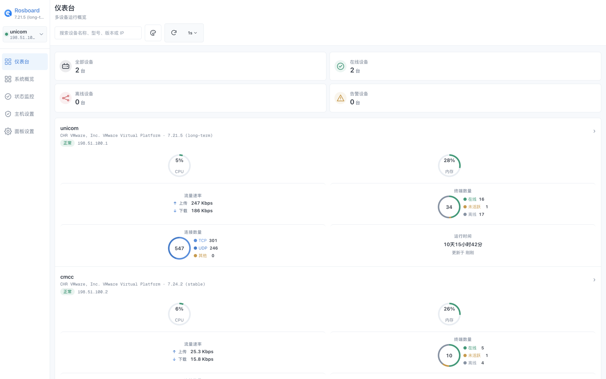
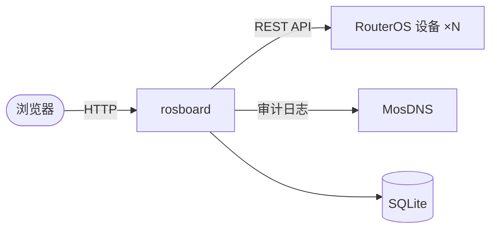

<div align="center">

# rosboard

**面向 RouterOS 的一体化局域网管理面板：监控、应用识别、策略分流、访问控制，装进一个单文件 Go 程序。**

[](https://github.com/jasonxtt/rosboard/releases)
[](LICENSE)
[](go.mod)




</div>

## 这是什么

rosboard 把一台或多台 RouterOS 设备集中到一个适合局域网部署的 Web 面板里：左边是实时运行状态，右边是能直接生效的路由策略。它通过 RouterOS REST API 采集和下发配置，面板自身的数据全部保存在本地 SQLite，不依赖任何外部服务。

与纯监控工具不同，rosboard 会直接管理路由器上的分流与管控规则——但只动自己创建的对象（详见[安全说明](#安全说明)）。

## 核心特性

- **多设备仪表台** —— 所有 RouterOS 设备的健康、流量、终端与告警一页尽览
- **全景监控** —— CPU / 内存 / 存储、接口速率与错误、终端在线状态、连接跟踪，历史趋势最长保留 35 天
- **策略路由分流** —— 「谁 → 访问什么 → 走哪条线路」可视化编辑，调和引擎自动下发 mangle / routing rule / DNS 等配置，支持 IPv4 / IPv6 双栈
- **访问控制** —— 断网与目标屏蔽规则，支持每周定时时段（如「周一至周五 20:00–22:00 屏蔽 B 站」）
- **目标库** —— 域名 / IP 列表一处维护、多处引用；内置常见应用预设（GitHub、Google、Telegram、YouTube…），支持远程订阅自动刷新
- **应用识别** —— 按应用 / 协议统计流量构成，可对接 MosDNS 审计日志做域名归因（适配 FakeDNS 场景）
- **双 UI 主题** —— Aurora 玻璃版与 Compact 紧凑版一键切换，响应式适配桌面与手机
- **在线更新** —— 面板内检查 GitHub Release；supervisor 守护下自动备份、原子替换、健康验证，失败自动回滚

## 更多界面

| 策略路由 | 访问控制 | 目标库 |
| --- | --- | --- |
|  |  |  |

| 终端监控 | 多设备仪表台 | Compact 紧凑版 |
| --- | --- | --- |
|  |  |  |

## 快速开始

### 使用发布包（推荐）

1. 从 [GitHub Releases](https://github.com/jasonxtt/rosboard/releases) 下载对应架构的压缩包并解压（通用 x86 服务器选 `linux_amd64`；`amd64-v3` 仅限支持 x86-64-v3 的处理器）。
2. 安装为 systemd 服务（示例安装到 `/opt/rosboard`）：

   ```bash
   sudo useradd --system --home /opt/rosboard --shell /usr/sbin/nologin rosboard
   sudo install -d -o rosboard -g rosboard /opt/rosboard
   sudo install -o rosboard -g rosboard -m 0755 ./rosboard /opt/rosboard/rosboard
   sudo install -o root -g root -m 0755 ./rosboard /opt/rosboard/rosboard-supervisor
   sudo curl -fsSL -o /etc/systemd/system/rosboard.service \
     https://raw.githubusercontent.com/jasonxtt/rosboard/main/deploy/rosboard.service
   sudo systemctl daemon-reload && sudo systemctl enable --now rosboard
   ```

3. 打开 `http://<服务器地址>:8080`：先创建管理员账号，再按「快速接入」引导把一段自动生成的脚本粘贴到 RouterOS Terminal，即完成设备接入。首次保存设备时会自动创建 `/opt/rosboard/config.yaml`，无需预先编辑任何配置。

### 从源码构建

```bash
cd web && npm ci && npm run build && cd ..
go build -o ./rosboard ./cmd/rosboard
./rosboard   # 默认监听 :8080
```

环境要求：Go 1.26.4（以 `go.mod` 为准）、Node.js 与 npm。

### RouterOS 侧要求

- RouterOS 7 或更高版本；使用 HTTP REST 时需 7.9+
- 快速接入脚本会自动创建 `read,write,test,api,rest-api` 权限的专用账号（详见[接入文档](docs/routeros-access.md)）

## 工作原理



rosboard 按周期从 RouterOS 采集运行状态；策略路由与访问控制规则保存在本地 SQLite，由调和引擎编译为 RouterOS 期望状态后与现网对账、增量下发。前端构建产物嵌入 Go 二进制，单进程交付。

## 文档

| 文档 | 内容 |
| --- | --- |
| [接入 RouterOS](docs/routeros-access.md) | 快速接入流程、账号权限模型、版本与 HTTP/HTTPS 要求 |
| [配置参考](docs/configuration.md) | 全部配置字段、环境变量、采集周期与页面刷新行为 |
| [部署与更新](docs/deployment.md) | systemd 部署、supervisor 守护、在线更新原理、发布产物 |
| [安全说明](docs/security.md) | 安全模型、密码重置、完全重新初始化 |
| [开发指南](docs/development.md) | 开发环境、测试与构建、项目结构、双 UI |

## 安全说明

- rosboard 会修改 RouterOS 配置，但**只管理自己创建的对象**：所有写入对象带 `rbs_` 前缀的归属标记，只读对象与人工配置不受影响
- 快速接入创建的专用账号**没有** `policy`、`sensitive` 等敏感权限；RouterOS 凭据保存在本地 `0600` 权限的 YAML 中，任何接口与导出不回传密码
- 单管理员账号 + 7 天滚动会话 + 登录限流；`/api/*` 与首次初始化页受 `allowed_cidrs` 网段限制
- rosboard 面向可信局域网设计，**不应直接暴露到公网**

更多细节见[安全说明](docs/security.md)。

## 当前限制

- 以 Linux + systemd 部署为主，暂未提供 Docker 镜像
- RouterOS 硬件能力与版本差异可能导致部分健康、IPv6 或策略数据不可用

## License

[MIT](LICENSE)
